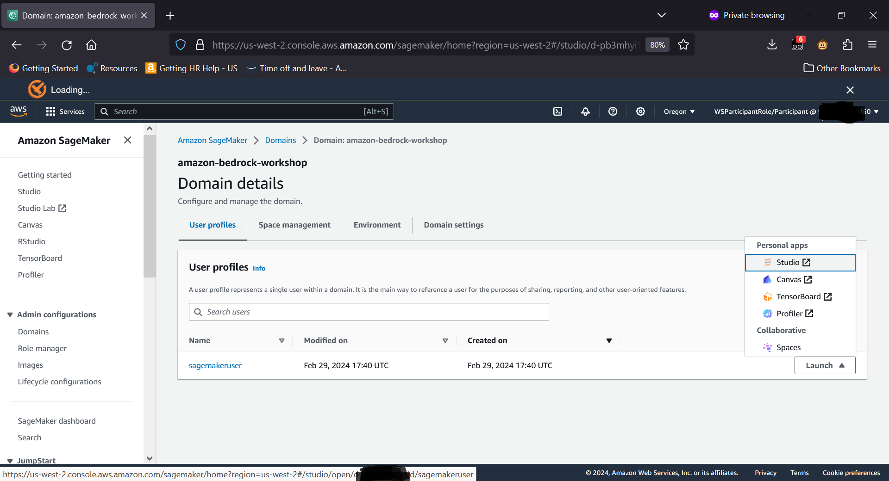

This GitHub repo provides a customization of Amazon Bedrock workshop for HCLS and/or Pubic Sector customers.
## Setup Instructions
### SageMaker Studio Setup

1. From the AWS Console, Search for **SageMaker** in the Services text box and select **Amazon SageMaker** from the search results

    

2. Click on the **Domains** option under the **Admin Configuarions** on the left menu

    

3. Click on the **amazon-bedrock-workshop** domain as shown below
    
    

4. Click on the **Launch** button and from the pop up selection, select **Studio**
    
    

5. It brings up the SageMaker Studio. Click on the **Studio Classic** from the **Applications** from the left.
    
    

6. Open the Jupyter Lab by clicking on the **Open**
    
    
 
7. You will see Jupyter Lab

    

8. Click on Git and Clone Repository

    

9. Copy and paste this Git Repo URL (https://github.com/SherryXDing/CMS-Bedrock-workshop) for the _URL_ and click **Clone**

    

10. Click the Folder Icon on the left side bar and double click on **00_Bedrock_API** folder

    

11. Open the Terminal

    

## Boto3 setup activity (Required)

12. Open bedrock_boto3_setup notebook and execute. Ignore pip's errors!

    

13. Uncomment (remove #) for os.environ... in the code and set the aws region the workshop is executing in.

    

    You should see a message like this:
    >  Create new client
     Using region: us-west-2
     boto3 Bedrock client successfully created!
     bedrock(https://bedrock.us-west-2.amazonaws.com)

## Text Summarization Activity

14. You have completed setting up required libraries to execute the lab. Now you can start the **text_summarization.ipynb** lab by opening the corresponding notebook and execute the code snippets.

15. Make sure you uncomment the following line **os.environ** in the code snippet and set correct **AWS region**. It can be different from what you see below. 
    

16. Execute other code snippets and experiment with the prompts. 

## LangChain Activity

17. Open **Langchain** notebook and start executing the note book code blocks

    

18. Make sure you have set the correct aws region in the following code block. Check the region where this workshop is executing by looking at the URL in the browser and set it accordingly( us-west-2 or us-east-1).

    

## Prompts for Knowledgebase

### Knowledge base description

This knowledgebase has information on medicare details, parts infromation for medicare plans, forms etc.

### Agent prompt

You are a helpful AI assistant to insurance members who can answer questions about medicare services, provide coverage summary when asked, provide application status and provide details about hospitals and doctors nearby based on < location >. You will be as helpful as possible and ask users for additional information if needed. You do not decide that you do not have enough information if you can ask the user for more input.

### Agent Knowledge base instruction

This Knowledge base has information about medicare details, coverage details, parts covered and forms.
