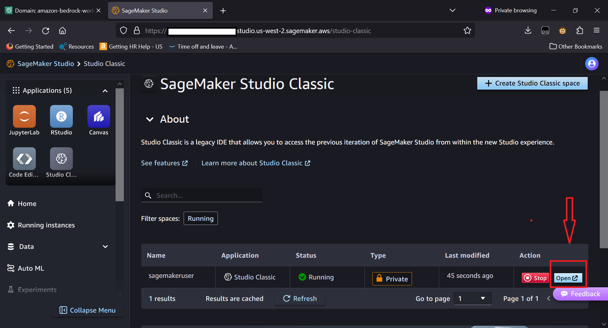
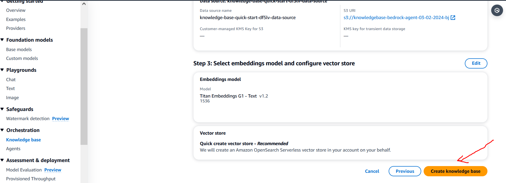
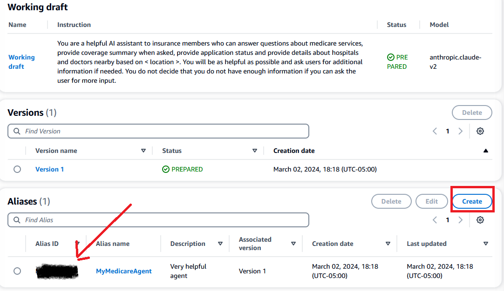

This GitHub repo provides a customization of Amazon Bedrock workshop for HCLS and/or Pubic Sector customers.
## Setup Instructions
## Login to AWS console
This workshop creates an AWS account. You will need the AWS Account Login URL provided by the workshop facilitators.
### STEPS
1. Connect to the workshop by browsing tohttps://catalog.us-east-1.prod.workshops.aws/join?access-code=<ReplacewithAccessCode> 
The following screen shows up where you will need to specify the event access code. 

2. Click Next.

3. Click on Email One-Time Password (OTP).

4. Enter Email (company email address) and click Send passcode.

5. It may take a few minutes to receive your passcode through your email. Enter the passcode and click Sign in.

6.  This should redirect you to the Terms and Conditions. Click on the box to agree and Click Join event.

7. This will take you to the workshop instructions page. On the bottom right corner of this screen click on Open AWS Console. This will open AWS Console in a new browser tab.

8. At the end of this workshop, if you are using your own AWS account, clean up your resources so you don't get charged.

### SageMaker Studio Setup

1. From the AWS Console, Search for **SageMaker** in the Services text box and select **Amazon SageMaker** from the search results

    

2. Click on the **Domains** option under the **Admin Configuarions** on the left menu

    

3. Click on the **amazon-bedrock-workshop** domain as shown below
    
    

4. Click on the **Launch** button and from the pop up selection, select **Studio**
    
    

5. It brings up the SageMaker Studio. Click on the **Studio Classic** from the **Applications** from the left.
    
    

6. Open the Jupyter Lab by clicking on the **Open**
    
    
 
7. You will see Jupyter Lab

    

8. Click on Git and Clone Repository

    

9. Copy and paste this Git Repo URL (https://github.com/SherryXDing/CMS-Bedrock-workshop) for the _URL_ and click **Clone**

    

10. Click the Folder Icon on the left side bar and double click on **00_Bedrock_API** folder

    

11. Open the Terminal

    

## Boto3 setup activity (Required)

12. Open bedrock_boto3_setup notebook and execute. Ignore pip's errors!

    

13. Uncomment (remove #) for os.environ... in the code and set the aws region the workshop is executing in.

    

    You should see a message like this:
    >  Create new client
     Using region: us-west-2
     boto3 Bedrock client successfully created!
     bedrock(https://bedrock.us-west-2.amazonaws.com)

## Text Summarization Activity

14. You have completed setting up required libraries to execute the lab. Now you can start the **text_summarization.ipynb** lab by opening the corresponding notebook and execute the code snippets.

15. Make sure you uncomment the following line **os.environ** in the code snippet and set correct **AWS region**. It can be different from what you see below. 
    

16. Execute other code snippets and experiment with the prompts. 

## LangChain Activity

17. Open **Langchain** notebook and start executing the note book code blocks

    

18. Make sure you have set the correct aws region in the following code block. Check the region where this workshop is executing by looking at the URL in the browser and set it accordingly( us-west-2 or us-east-1).

    

# Building generative AI applications with Amazon Bedrock using agents
## Overview 

This workshop details the setup process of an application that will use an agent on Amazon Bedrock. This will include setting up S3 buckets, a knowledge base, action group, Lambda function.
    
The agent is designed to answer general questions on Medicare plans, eligibility, coverage details, application status.

## Intended Audience
This workshop is intended for the following audiences:
* Solution Architects
* Software Development Engineers
* Generative AI enthusiasts
## Prerequisites
* You will need an active AWS Account (AWS Workshop accounts are provisinoned for AWS conducted workshops)
* Familiarity with AWS services like Amazon Bedrock, S3, Lambda.
* This workshop will take about 1-2 hours to complete
* For the purpose of this workshop and included code, the preferred region is us-west-2.
* If you need to run this workshop in another region, you will need to modify the region accordingly at a later step.

## Workshop Structure
* There are 5 modules in this workshop:

    * Setup Amazon S3 buckets
    * Setup AWS Lambda function
    * Setup agent and Action group
    * Setup Knowledge base with Amazon Bedrock agent
    * Testing the Setup

## Workshop Architecture

The AWS Services that are used in this workshop are:

* **Amazon Bedrock** is a comprehensive, serverless service that simplifies the development of generative AI applications by providing access to top-tier foundation models from leading AI companies through a single API, along with customization options and seamless integration with familiar AWS services.

* **Amazon S3** (Simple Storage Service) offers scalable object storage for data backup, archival, and analytics, with 99.999999999% (11 9's) of durability and stores data for millions of applications.

* **AWS Lambda** lets you run code without provisioning or managing servers. You pay only for the compute time you consume, making it a cost-effective solution to run code in response to HTTP requests via Amazon API Gateway, event triggers, or direct calls.

* **Amazon OpenSearch Serverless** is a scalable and fully managed service for deploying, operating, and scaling OpenSearch clusters in the AWS Cloud.

## Storyline
### Creating a Virtual Assistant to Improve the Senior Healthcare Experience

**Setting the Scene:** We find ourselves in a busy call center that helps Medicare beneficiaries understand their coverage options. Phones are ringing off the hook as seniors try to navigate the complex world of Medicare.

**The Problem:** Call wait times are long as the few agents struggle to keep up with questions on plans, benefits, eligibility, and more. Seniors are frustrated and agents are overwhelmed. 

**The Inspiration:** After seeing the agents' struggle, the call center manager is inspired to leverage AI and create a virtual assistant to help triage calls and answer common questions, freeing up the human agents.

**The Challenge:** Creating an AI agent that can understand complex Medicare questions and guide beneficiaries is extremely difficult. The agent needs to be meticulously trained.

**The Solution:** The call center team builds the virtual assistant "Ava" on AWS Bedrock, an optimal platform for creating AI agents. They feed her thousands of Medicare documents and train her on the various topics.

**The Impact:** Once implemented, Ava is a huge success! Wait times decrease as she efficiently answers common questions. The human agents can now focus on the more complex cases. Seniors are happier and the agents are less stressed.

**The Invitation:** Intrigued by the success? Join our workshop to learn how you can leverage AWS Bedrock to build AI virtual agents! Help us improve Ava even more! 

## Module 1 - Setup Amazon S3 Buckets and Knowledge base
### Configuaration and Setup
You will now be setting up the S3 buckets and Knowledge base.
### Creating S3 Buckets
#### Step 1: Setup S3 and load files
Domain Data Bucket: Navigate to the Amazon S3 console and create an S3 bucket. Use the default settings. This S3 bucket will be used to store the domain data. Call the S3 bucket knowledgebase-bedrock-agent-**{alias}**. We will use the default settings.
**Make sure to update _{alias}_ with the appropriate value throughout this workshop. Suggestion:create alias in the format, mm-dd-yyyy-your initials in lower case.** 
**eg: 03-02-2024-ab**

* Next, we will download the Medicare 2024 Handbook from [here](https://www.medicare.gov/Pubs/pdf/10050-medicare-and-you.pdf). Download the pdf to your local computer.

* The file will download to your Downloads folder. Upload the file to S3 bucket knowledgebase-bedrock-agent-{alias}. The medicare handbook contains information for the medicare beneficiaries on the plans, eligibility, coverage and sign up details etc. Once uploaded, please select the document to open and review the content.

* **Artifacts Bucket:** Create another S3 bucket to store artifacts. For example, call it artifacts-bedrock-agent-creator-{alias}. Then, download the API schema file [here](https://raw.githubusercontent.com/SherryXDing/CMS-Bedrock-workshop/main/bedrock-agents/open-api-schema-member-services.json) 

* Upload this file from the Downloads folder to S3 bucket artifacts-bedrock-agent-creator-{alias}. The provided API schema is an OpenAPI specification for Member services APIs for finding services, looking up application statues, getting coverage details. This API Schema is a rich description of each action, so agents know when to use it, and how to call it and use results. This schema defines three primary endpoints,*/find-care-providers/hospital/{location}, /find-care-providers/physician/{location},  /beneficiaries/application-status/{beneficiaryID} and /beneficiaries/coverage-summary/{beneficiaryID}* detailing how to interact with the API, the required parameters, and the expected responses. Once uploaded, please select and open the .json document to review the content

**_Now, the team at CMS are looking optimistic! but still wondering if this is too good to be true. "I wonder if we will still have to analyze all of these documents to gather enough information to support our beneficiaries" they ask themselves.._**

## Grant model access & Setup Knowledge base
### Step 2: Grant model access and create KB
* Before we setup the knowledge base, we will need to grant access to the models that will be needed for our agent in Bedrock. Navigate to the Amazon Bedrock console. On the left of the screen, scroll down and select **Model access**. On the right, select the orange **Manage model access** button.

* Select the checkbox for the base model columns **Amazon: Titan Embeddings G1 - Text** and **Anthropic: Claude and Claude Instant**. This will provide you access to the required models. After, scroll down to the bottom right and select **Request model access**.

* After, verify that the access status of the models is **green** with **Access granted**.

* Now, we will create a knowledge base by selecting **Knowledge base** on the left, then selecting the orange button **Create knowledge base**.

* You can use the default name, or enter in your own. Then, select **Next** at the bottom right of the screen.

* Sync S3 bucket *knowledgebase-bedrock-agent-{alias}* to this knowledge base.

* For the embedding model, choose **Titan Embeddings G1 - Text v1.2.** Leave the other options as default, and scroll down to select **Next**.

* On the next screen, review your work, then select **Create knowledge base**

**Once your data source completes syncing you will be able to move to the next step.**

**_"Wow! that was easy enough. I wonder what the catch is" the team asks themselves. With CMS team being new to Generative AI, they are wondering if they have enough skills to build this workload out._**

## Module 2 - Setup AWS Lambda function

## Configuration and setup

Now, it is time to create the Lambda function.
## Lambda Function Configuration

### Step 3: Create an AWS Lambda function for the Action group

* Navigate to **Lambda** Service Console (Search for *Lambda* in Service Search and Select Lambda from the results ) 

* Click on **Create function** button

* Create a Lambda function (Python 3.12) for the Bedrock agent's action group. We will call this Lambda function **MedicareMemberServices-actions**. We are creating this function for an action group in order to carry out various tasks.

* Copy the python code from the file here [here](https://raw.githubusercontent.com/SherryXDing/CMS-Bedrock-workshop/main/bedrock-agents/member-services-lambda.py) 
into your Lambda function.

* Then, select **Deploy** in the tab section of the Lambda console. Review the code provided before moving to the next step. You will see that we are using mock data to represent various responses to the beneficary related service questions/actions, along with functions that we will call later in this workshop.

* Now, we will apply a resource policy to the Lambda to grant Bedrock agent access. To do this, we will switch the top tab from **Code** to “configuration” and the side tab to **Permissions**. Then, scroll to the **Resource-based policy statements** section and click the **Add permissions** button.

* Here is an example of the resource policy. (At this part of the setup, we will not have a Bedrock agent Source ARN. So, enter in **arn:aws:bedrock:us-west-2:{accoundID}:agent/BedrockAgentID** for now.)
    1. Pick "AWS service"
    2. Service : Pick "Other"
    3. Statement ID: allow-bedrock-agent
    4. Principal: bedrock.amazonaws.com
    5. Source ARN: arn:aws:bedrock:us-west-2:{accoundID}:agent/BedrockAgentID
    **Make sure to replace {accountID} with your provisioned account id. We will come back to change the BedrockAgentID to actual Id once the agent is created in the following steps**
    6. Action: Choose lambda:InvokeFunction

     

**_Now, CMS team is feeling really good that they are building out the product that they envisioned!_**

## Prompts for Knowledgebase

### Knowledge base description

This knowledgebase has information on medicare details, medicare parts infromation for medicare plans, forms etc.

## Module 3 - Setup agent and Action group
### Configuration and setup
We will now be configuring an agent with an Action group.
### Setup Amazon Bedrock agent
#### Step 4: Create an agent in Amazon Bedrock
* 
    Navigate to the Bedrock console, go to the toggle on the left, and under Orchestration select Agents, then select Create Agent.

* 
    On the next screen, provide an agent name, like **MedicareMemberServicesProvider**. Leave the other options as default, then select Next.

* Select the Anthropic: Claude V2 model. Then, add instructions by creating a prompt that defines the rules of operation for the agent. In the prompt below, we provide specific direction on how the model should use tools to answer questions. Copy, then paste the details below into the agent instructions.

**_You are a helpful AI assistant to insurance members who can answer questions about medicare services, provide coverage summary when asked, provide application status and provide details about hospitals and doctors nearby based on < location >. You will be as helpful as possible and ask users for additional information if needed. You do not decide that you do not have enough information if you can ask the user for more input._**

* When creating the agent, select Lambda function **MedicareMemberServices-actions**. Next, select the schema file **open-api-schema-member-services.json** from the s3 bucket **s3://artifacts-bedrock-agent-creator-{alias}**. Your now done with creating the action group. Select **Next**.

## Module 4 - Sync Knowledge base with an agent on Amazon Bedrock

#### Configuration and Setup
 Lets now sync the Knowledge base with the agent.

### Sync Knowledge base with Amazon Bedrock agent
#### Step 5: Add Instruction to the Knowledge base

* When integrating the KB with the agent, you will need to provide basic instructions on how to handle the knowledge base. For example, use the following:

**_This Knowledge base has information about medicare details, coverage details, parts covered and forms._**

*  Review, then select Create Agent .

**_"Hey look! we have another co-worker now. We'll call it Mr. Agent". The team joked around, while suggesting just the right instructions to provide to the agent._**

### Creating an alias
#### Step 6: Create an alias
* Create an alias (new version), and choose a name of your liking. Make sure to copy and save your agent Alias ID. You will need this in step 9.

* Next, scroll up to the Agent Overview settings for the agent, and copy the **Agent ARN** (copy seperatly the **Agent ID** as well, because you will need this in the next steps.). Add the agent ARN to the resource policy of Lambda function **MedicareMemberServices-actions** previously created in step 3.

* Edit the resource based policy of the Lambda function created in previous steps.

* Update the **BedrockAgentID** with the **Agent ID** copied from the previous step
_arn:aws:bedrock:us-west-2:{accoundID}:agent/**BedrockAgentID**_

## Module 5 - Testing the Setup
It's time to test!

### Testing the Setup
#### Step 7: Testing the setup
##### Testing the Knowledge Base
* While in the Amazon Bedrock console, select **Knowledge base** under the *Orchestration tab*, then the KB you created. Scroll down to the Data source section, and make sure to select the **Sync** button.

* You will see a user interface on the right where you will need to select a model. Choose the **Anthropic Claude V2 model**, then select **Apply**.

* You can now enter prompts in the user interface provided. Explore the source details and citations to understand the basis for the responses.

* Test Prompts to **Test Knowledge Base**: 
1. When is Medicare open enrollment closing?
2. Who is eligible for Medicare?
3. I'm 65 year old, still working with employer provided medical insurance. What are my options with respect to Medicare enrollment?
4. When will Medicare coverage begins in 2024?
5. What are benefits are covered under Medicare for free of cost?
6. Do I need to pay a premium for Medicare plans? 

### Test Agents

* You will see a user interface on the right where you will need to select a model. Choose the **Anthropic Claude V2 model**, then select **Apply**.

*  You can now enter prompts in the user interface provided. Explore the trances to understand how the Agent is arriving with the responses.

* Test Prompts to **Test Agent**: 
1. When is Medicare open enrollment closing?
2. What is my coverage status? 
    * Agent can ask for beneficiary id? ( Provide **2** or any input)
3. Can you help me find doctors in Washington DC?
3. Can you find me highest rated physician in Washington DC area?
4. Can you find me a highly rated hospital in Washington DC?

## THE END
### Congratulations!! 
### Summary

Overview: In this workshop, we embarked on an exciting journey to develop a GenerativeAI application capable of providing support services to Medicare Beneficiaries. Utilizing Amazon Bedrock , we achieved a seamless integration of various AWS services, demonstrating the power of cloud computing in the realm of CMS's Medicare Program.

Key Achievements:

**Setting Up Amazon Bedrock Agent on AWS:** We successfully established S3 buckets for storing domain data and artifacts. A knowledge base was configured for our Bedrock agent, integrating Medicare Handbook document. We created and configured a Lambda function, "MedicareMemberServices-actions" tailored for the application's unique needs.

**Building the Knowledge Base:** Participants gained hands-on experience in setting up and syncing a knowledge base with the Bedrock agent. We focused on leveraging the Anthropic: Claude V2.0 model for intelligent data interpretation.

**Configuring AWS Lambda Function:** We delved into the intricacies of Python 3.12 to craft a functional Lambda setup. The workshop provided insights into resource policy application and Lambda function deployment.

**Agent and Action Group Setup:** The creation of the "MyMedicareAgent" agent enabled us to define operational rules and integrate the Lambda function. We highlighted the process of creating an agent alias and implementing action groups for providing customized services for a given Medicare Beneficiary.

**Impact and Takeaways:** The workshop not only equipped participants with the technical know-how but also provided a broader understanding of how agents on Amazon Bedrock can revolutionize support services for millions of Medicare Beneficiaries. This hands-on experience has laid a foundation for innovative approaches to Medicare program.